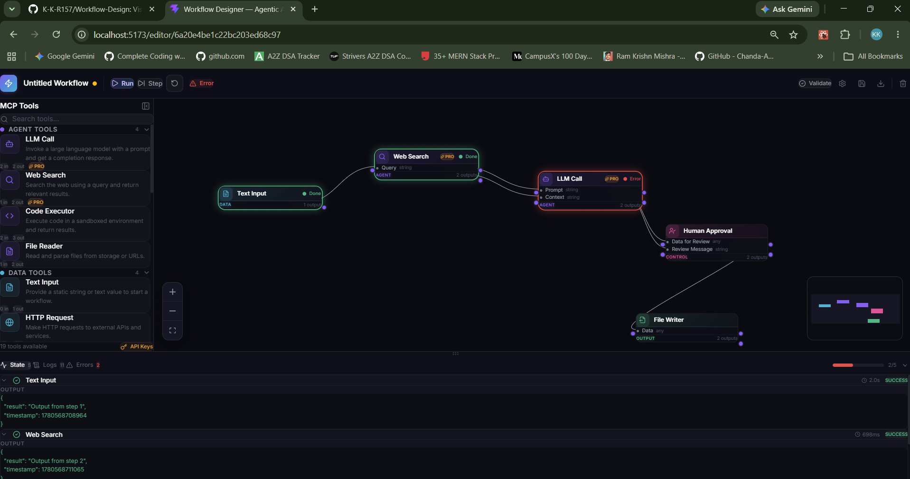

<div align="center">

# 🔧 Human-in-the-Loop Workflow Designer
### Visual Programming Interface for Agentic Workflows

[](https://reactjs.org/)
[](https://nodejs.org/)
[](https://mongodb.com/)
[](https://tailwindcss.com/)
[](https://socket.io/)
[](LICENSE)

A drag-and-drop visual programming interface where users compose multi-agent AI workflows by placing MCP (Model Context Protocol) Tools as nodes — with real-time data flow validation and live step-through execution with state inspection.

[Features](#-features) • [Architecture](#-architecture) • [Tech Stack](#-tech-stack--rationale) • [Getting Started](#-getting-started) • [Usage](#-usage-guide) • [API Reference](#-api-reference) • [Design Decisions](#-key-engineering-decisions)



</div>

---

## 📌 Overview

The **Human-in-the-Loop Workflow Designer** is a visual programming interface designed to compose, validate, and execute multi-agent workflows. The core philosophy is to provide a highly interactive, reliable, and real-time experience where users can build complex sequences of AI operations using MCP tools — and seamlessly integrate human oversight into automated tasks at any step.

### What is MCP?
MCP (Model Context Protocol) is an open standard by Anthropic that defines a universal interface for AI models to connect to external tools and data sources. Each MCP Tool has a defined `inputSchema` and `outputSchema`, making them composable building blocks for agentic workflows. Think of it as a "USB standard for AI" — any model can plug into any tool using the same interface.

---

## ✨ Features

| Feature | Description |
|---|---|
| 🎨 **Visual Workflow Builder** | Intuitive drag-and-drop canvas powered by React Flow with pan, zoom, and edge routing |
| 🤖 **Node-Based Architecture** | Compose workflows using tool categories: Agent, Data, Transform, Output, and Control Flow |
| 🙋 **Human-in-the-Loop** | Dedicated "Human Approval" nodes pause execution for manual review before continuing |
| ✅ **Real-Time Validation** | Instant cycle detection and data type checking — errors shown on the canvas as you build |
| ▶️ **Live Execution Engine** | Execute workflows node-by-node with real-time progress updates streamed via Socket.IO |
| 🔍 **State Inspector** | View live logs, step duration, and exact JSON input/output for every node during execution |
| 🔐 **Authentication** | JWT-based user auth with bcrypt password hashing and per-user workflow persistence |
| 🔑 **API Key Management** | Support for external services — OpenAI, Anthropic, Google, SerpAPI, SendGrid |

---

## 🏗️ Architecture

The application is built on a decoupled **Client-Server Architecture**:

- **Client (Frontend)** — A Single Page Application responsible for the drag-and-drop canvas, configuration panels, real-time visual feedback, and user state management.
- **Server (Backend)** — A RESTful API combined with a WebSocket server responsible for persistent storage, authentication, graph validation, and the step-by-step execution engine.

Decoupling ensures that long-running or resource-intensive AI tasks execute securely on the server (where sensitive API keys live), while the frontend stays lightweight and focused entirely on the user experience.

```
┌────────────────────────────────────────────────────────────┐
│           Frontend  (React + Vite + React Flow)             │
│                                                             │
│  ┌─────────────┐  ┌────────────────┐  ┌─────────────────┐  │
│  │  Drag-Drop  │  │  Node Config   │  │ State Inspector │  │
│  │  Canvas     │  │  Panel         │  │ + Exec Controls │  │
│  └─────────────┘  └────────────────┘  └─────────────────┘  │
└───────────────────────────┬────────────────────────────────┘
                            │  REST API + Socket.IO
┌───────────────────────────▼────────────────────────────────┐
│           Backend  (Node.js + Express)                       │
│                                                             │
│  ┌───────────────┐  ┌──────────────────┐  ┌─────────────┐  │
│  │  Workflow API │  │ Execution Engine │  │  Validator  │  │
│  │  (CRUD + Auth)│  │ (DAG + Topo Sort)│  │  (DFS + Types)│ │
│  └───────────────┘  └──────────────────┘  └─────────────┘  │
└──────────────┬───────────────────────────────┬─────────────┘
               │                               │
   ┌───────────▼──────────┐    ┌───────────────▼──────────────┐
   │      MongoDB          │    │      MCP Tool Registry        │
   │  Users, Workflows,    │    │  tools.json — schemas, meta,  │
   │  Runs, State snapshots│    │  handler references           │
   └───────────────────────┘    └──────────────────────────────┘
```

### Frontend Component Structure
```
App.jsx  (React Router)
├── LoginPage.jsx              — register / login forms
├── HomePage.jsx               — workflow list, create / delete
└── EditorPage.jsx             — main editor layout
    ├── ToolPanel.jsx          — left sidebar, draggable tool tiles
    ├── WorkflowCanvas.jsx     — React Flow canvas
    │   ├── CustomNode.jsx     — MCP tool node with live status badge
    │   └── CustomEdge.jsx     — schema-validated, animated connection
    ├── NodeConfig.jsx         — right panel, config form per node
    ├── StateInspector.jsx     — bottom drawer, live JSON I/O viewer
    └── ExecutionBar.jsx       — Run / Pause / Step / Reset toolbar
```

### Backend Module Structure
```
server/
├── server.js                  — Express app + Socket.IO attach
├── routes/                    — auth, workflow, run, tool routes
├── controllers/               — request handlers per route group
├── models/                    — User, Workflow, Run (Mongoose schemas)
├── services/
│   ├── ExecutionEngine.js     — topological sort + async node runner
│   ├── ValidatorService.js    — type-check edges + DFS cycle detection
│   └── SocketManager.js       — Socket.IO event emitter wrapper
├── handlers/                  — one file per MCP tool implementation
└── registry/tools.json        — MCP tool definitions (schemas + metadata)
```

---

## 🛠️ Tech Stack & Rationale

### Frontend

| Technology | Why it was chosen |
|---|---|
| **React + Vite** | React's component model is ideal for building complex, interactive UIs like property inspectors and canvas tools. Vite provides lightning-fast HMR and optimized builds — significantly better developer experience than Create React App. |
| **React Flow (`@xyflow/react`)** | Building a performant drag-and-drop node canvas with panning, zooming, and edge routing from scratch is notoriously difficult. React Flow solves all of this while allowing complete customization of node and edge components. |
| **Redux Toolkit** | Application state is complex — canvas state, execution state, user state, and API key config all need to be accessible across deeply nested components (State Inspector, Node Config, Toolbar). Redux prevents prop-drilling and keeps state predictable. |
| **Tailwind CSS** | Utility-first CSS enables rapid prototyping and a consistent design system without managing bloated stylesheets. Essential for achieving the dark-mode glassmorphism aesthetic. |
| **Framer Motion** | Smooth micro-animations (sidebar expand, node config open, success/error states) make the interface feel alive and professional. |
| **Lucide React** | Clean, lightweight, and consistent icon library that integrates naturally with React. |

### Backend

| Technology | Why it was chosen |
|---|---|
| **Node.js + Express** | Node's async, event-driven architecture handles multiple simultaneous long-running workflow executions without blocking. Express is lightweight, well-understood, and has a rich middleware ecosystem (CORS, JWT validation, error handling). |
| **MongoDB + Mongoose** | Workflows are graphs — arbitrary nodes with custom configs and edges. This data is naturally document-shaped and doesn't fit rigid SQL schemas. Mongoose adds schema validation and structure on top of MongoDB's flexibility. |
| **Socket.IO** | When a user runs a 10-step workflow, they expect live progress updates — not polling. Socket.IO lets the execution engine push `node:start`, `node:done`, and `node:error` events directly to the frontend the moment they happen. |
| **JWT + bcryptjs** | JWT provides stateless auth — no server-side session storage needed, making the backend more scalable. bcrypt securely hashes passwords before storage so credentials are never kept in plaintext. |

### Algorithms & Concepts Used

| Concept | Where applied |
|---|---|
| **DAG (Directed Acyclic Graph)** | The workflow graph model — nodes are tools, edges define data flow |
| **Topological sort (Kahn's algorithm)** | Execution engine determines the correct order to run nodes |
| **DFS cycle detection** | Validator prevents users from creating infinite loops in the graph |
| **JSON Schema type matching** | ValidatorService compares `outputSchema` of source to `inputSchema` of target for each edge |
| **Event-driven architecture** | Socket.IO events decouple execution state from the HTTP request lifecycle |

---

## 🚀 Getting Started

### Prerequisites
- Node.js v18 or higher
- MongoDB running locally, or a MongoDB Atlas connection string

### 1. Clone the repository
```bash
git clone <repository-url>
cd Workflow-Design
```

### 2. Backend setup
```bash
cd backend
npm install
```
Create a `.env` file inside `backend/`:
```env
PORT=5000
MONGO_URI=mongodb://localhost:27017/workflow-designer
JWT_SECRET=your_jwt_secret_here
FRONTEND_URL=http://localhost:5173
```

### 3. Frontend setup
```bash
cd ../frontend
npm install
```
Create a `.env` file inside `frontend/`:
```env
VITE_API_URL=http://localhost:5000
VITE_SOCKET_URL=http://localhost:5000
```

### 4. Run the application

Open two terminal windows:

**Terminal 1 — Backend:**
```bash
cd backend
npm run dev
```

**Terminal 2 — Frontend:**
```bash
cd frontend
npm run dev
```

Open [http://localhost:5173](http://localhost:5173) in your browser.

---

## 📖 Usage Guide

1. **Sign up / Log in** — Register a new account or log in with existing credentials.
2. **Create a workflow** — Click "New Workflow" from the dashboard.
3. **Build** — Drag tools from the left sidebar onto the canvas. Connect the output handle (right side of a node) to the input handle (left side) of the next node.
4. **Configure** — Click any node to open the Node Config panel. Set required parameters, choose models, and enter any tool-specific settings.
5. **Validate** — Click "Validate" to check the graph for missing required fields, type mismatches, and cycles. Errors appear directly on the affected nodes and edges.
6. **Execute** — Click "Run" to execute the full workflow, or "Step" to advance one node at a time. Watch nodes highlight as they execute. View live input/output JSON in the State Inspector panel at the bottom.
7. **Human approval** — When execution reaches a "Human Approval" node, it pauses and waits. Review the data in the State Inspector, then click Approve or Reject to continue.

---

## 🧠 Key Engineering Decisions

### Human-in-the-Loop mechanism
When the execution engine encounters a `Human Approval` node, it emits a `node:paused` Socket.IO event and halts the execution loop for that workflow run. The current payload is saved to the database. When the user approves or rejects via the UI, a REST endpoint is called which re-awakens the engine, injects the human decision into the data flow, and execution resumes from that point.

### Validation engine
Before a workflow can be saved or executed, it passes through the `ValidatorService`:
- **Cycle detection** — A DFS algorithm traverses the graph and rejects any workflow containing a cycle, preventing infinite execution loops.
- **Type checking** — Each edge is checked by comparing the `outputSchema` of the source node to the `inputSchema` of the target. Connecting a `boolean` output to an `array` input is rejected before the workflow ever runs.

### Real-time state inspection
As Socket.IO events arrive (`node:started`, `node:success`, `node:error`), Redux dispatches update the store. This simultaneously triggers React Flow to update the visual styling of nodes (pulsing border for active, green for done, red for error) and updates the State Inspector panel with the exact JSON payload and execution duration for that node.

### Why server-side execution?
Complex, long-running agent tasks (LLM calls, web searches, code execution) run on the server — not in the browser. This keeps sensitive API keys off the client, allows the backend to manage execution state across reconnections, and means a browser tab closing does not kill a running workflow.

---

## 📡 API Reference

### Auth
| Method | Endpoint | Body | Description |
|---|---|---|---|
| `POST` | `/api/auth/register` | `{ email, password }` | Create a new account |
| `POST` | `/api/auth/login` | `{ email, password }` | Returns a JWT token |

### Workflows
| Method | Endpoint | Auth | Description |
|---|---|---|---|
| `GET` | `/api/workflows` | ✅ | List all workflows for current user |
| `POST` | `/api/workflows` | ✅ | Create a new workflow |
| `GET` | `/api/workflows/:id` | ✅ | Fetch a single workflow with nodes + edges |
| `PUT` | `/api/workflows/:id` | ✅ | Update an existing workflow |
| `DELETE` | `/api/workflows/:id` | ✅ | Delete a workflow |

### Execution
| Method | Endpoint | Auth | Description |
|---|---|---|---|
| `POST` | `/api/run/start` | ✅ | Start executing a workflow |
| `POST` | `/api/run/pause` | ✅ | Pause after the current node |
| `POST` | `/api/run/reset` | ✅ | Reset execution state |
| `POST` | `/api/run/approve` | ✅ | Approve a paused Human Approval node |
| `POST` | `/api/run/reject` | ✅ | Reject a paused Human Approval node |

### Tools
| Method | Endpoint | Auth | Description |
|---|---|---|---|
| `GET` | `/api/tools` | ✅ | Get all available MCP tool definitions |

### Socket.IO Events

**Server → Client**

| Event | Payload | When emitted |
|---|---|---|
| `node:start` | `{ nodeId, input }` | Node begins executing |
| `node:done` | `{ nodeId, input, output, duration }` | Node finishes successfully |
| `node:error` | `{ nodeId, error }` | Node throws an error |
| `node:paused` | `{ nodeId, payload }` | Human Approval node is waiting |
| `run:complete` | `{ runId, summary }` | All nodes finished |
| `run:error` | `{ errors[] }` | Validation failed before execution |

**Client → Server**

| Event | Payload | When sent |
|---|---|---|
| `run:pause` | `{ runId }` | User clicks Pause |
| `run:resume` | `{ runId }` | User clicks Resume |

---

## 🗂️ Project Structure

```
Workflow-Design/
├── frontend/
│   ├── src/
│   │   ├── components/
│   │   │   ├── canvas/          — WorkflowCanvas, CustomNode, CustomEdge
│   │   │   ├── panels/          — ToolPanel, NodeConfig, StateInspector
│   │   │   └── execution/       — ExecutionBar
│   │   ├── hooks/               — useSocket, useWorkflow
│   │   ├── pages/               — HomePage, EditorPage, LoginPage
│   │   ├── services/            — api.js (Axios), validator.js
│   │   ├── store/               — Redux slices (workflow, execution, auth)
│   │   └── utils/               — socketClient.js
│   ├── .env.example
│   └── package.json
│
├── backend/
│   ├── config/                  — db.js, constants.js
│   ├── controllers/             — auth, workflow, run, tool
│   ├── handlers/                — one file per MCP tool
│   ├── middleware/              — authMiddleware, errorHandler
│   ├── models/                  — User, Workflow, Run
│   ├── registry/tools.json      — MCP tool definitions
│   ├── routes/                  — auth, workflow, run, tool
│   ├── services/                — ExecutionEngine, ValidatorService, SocketManager
│   ├── server.js
│   ├── .env.example
│   └── package.json
│
├── docs/
│   └── assets/
│       └── demo.png             ← add your screenshot here
│
└── README.md
```

---

## 🔮 Future Improvements

- [ ] Real MCP tool integrations (live web search, code sandbox, email sending)
- [ ] Parallel node execution for independent branches in the graph
- [ ] Workflow version history and rollback
- [ ] Export workflow as JSON / import from JSON
- [ ] Shareable workflow links (public read-only view)
- [ ] Execution scheduling (cron-based, run at intervals)
- [ ] Sub-workflow nodes (embed one workflow inside another)

---

## 👤 Author

**Your Name**
- GitHub: [KUNDAN KUMAR](https://github.com/your_username)
- LinkedIn: [https://www.linkedin.com/in/kundan-kumar-27475927b/](https://linkedin.com/in/your-linkedin)

---

## 📄 License

This project is licensed under the MIT License — see the [LICENSE](LICENSE) file for details.

---

<div align="center">
Built as part of an internship assignment — Human-in-the-Loop Workflow Design
</div>